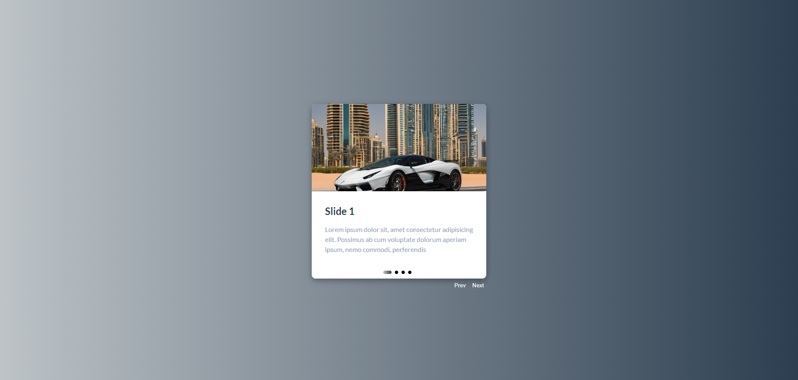

# Day 5 - Modern Card Slider

This project is an interactive web component that enables users to browse through a series of cards in a sleek, modern slider format. It showcases the use of advanced CSS techniques and JavaScript to create a responsive and dynamic user experience. The slider is designed to be both aesthetically pleasing and functional, allowing users to easily navigate through content.

## Features

- **Dynamic Interaction**: Users can interact with the slider using navigation arrows or swipe gestures on touch-enabled devices.
- **Responsive Design**: The slider adjusts to different screen sizes, ensuring a seamless experience across all devices.
- **Modern Aesthetics**: Utilizes contemporary design trends for a clean and engaging user interface.
- **Smooth Animations**: Implements smooth transition effects for sliding motion, providing a more interactive feel.

## Project Structure

- `index.html`: The primary HTML document that includes the structure and links to the JavaScript and CSS files.
- `style.css`: The stylesheet that defines the appearance and animations for the card slider.
- `index.js`: The JavaScript file that enables the dynamic functionality of the slider, handling user inputs and updating the display.

## Card List

- Each card in the slider represents a unique item or content that users can view by navigating through the slider.

## Usage

To see the slider in action, open the `index.html` file in a contemporary web browser. Make sure your device is compatible with the latest web technologies for full functionality.

## Screenshot

---

Feel free to explore the code, and if you have any questions or suggestions, please reach out or open an issue.
