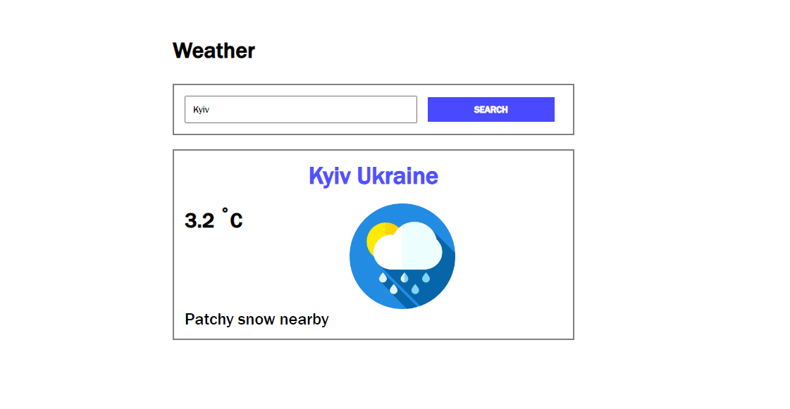

# DAY 7 - Weather Information Web App

This project is a web-based application that provides real-time weather information by fetching data from the WeatherAPI. It's designed to offer users the ability to search for weather conditions in different cities worldwide. Utilizing HTML, CSS, and JavaScript, this application demonstrates how to interact with external APIs, process JSON responses, and dynamically update the web interface based on user input.

## Features

- **Real-Time Weather Data**: Users can search for the current weather conditions of any city across the globe.
- **Dynamic Content Generation**: The application dynamically generates content based on API responses, displaying relevant weather information such as temperature, weather conditions, and country.
- **Error Handling**: Implements error handling to inform the user about incorrect city input or issues fetching data.
- **Modern Design**: Features a clean, user-friendly interface with a focus on readability and ease of use.
- **Responsive Layout**: Ensures a consistent experience across various devices with a layout that adjusts to different screen sizes.

## Project Structure

- `index.html`: The main HTML document that structures the web application, including the form for city input and the area where weather information is displayed.
- `style.css`: The CSS file that defines the visual aspect of the application, including layout, colors, and fonts, ensuring a modern and attractive design.
- `script.js`: The JavaScript file responsible for the application's functionality, handling form submissions, API requests, data processing, and dynamic content updating.

## Usage

- Users enter the name of a city in the provided input field and submit the form.
- The application fetches weather data for the specified city using the WeatherAPI and displays it on the page.
- If the city name is incorrect or an error occurs during data fetching, the application displays an error message.

## Screenshot

---

This project serves as an excellent example of integrating external APIs into web applications for dynamic content update based on user input. It showcases fundamental web development skills, including API interaction, responsive design, and client-side data processing. For further exploration or contributions, feel free to dive into the code.
